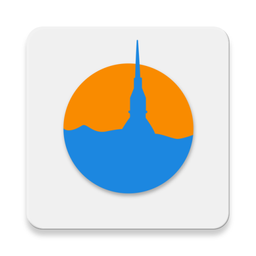

 
 
 <h1>TOurist</h1>
 
A simple Turin Tourism app for Android

<h2 align="center">Feautures</h2>

- Selection of single, couple or group travel
- Selecting a spending budget
- Select the number of days or hours you intend to visit the city of Turin
- Viewing on Google Maps of places of interest, based on previous choices, divided by museums, cinemas and restaurants
- Display of today's temperature and time via header graphics

 <h2>Screenshots</h2>

 
 
 
 
 

 <h2>Collaborators</h2>

  [Razvan Apostol](https://github.com/r-apostol-9618)
   
  [Federica Vacca](https://github.com/bakicchan)

