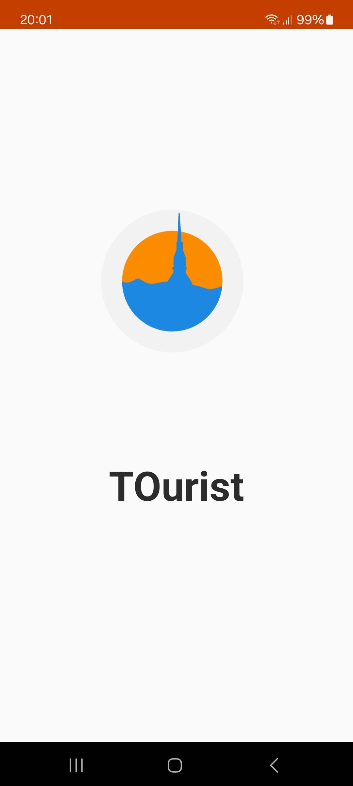
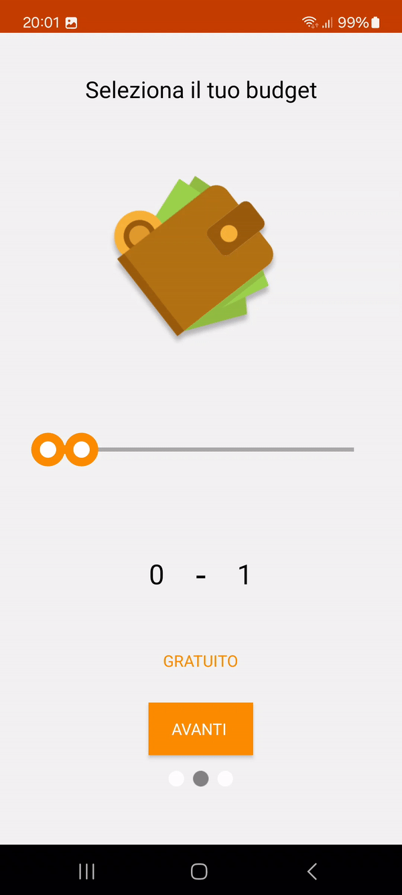
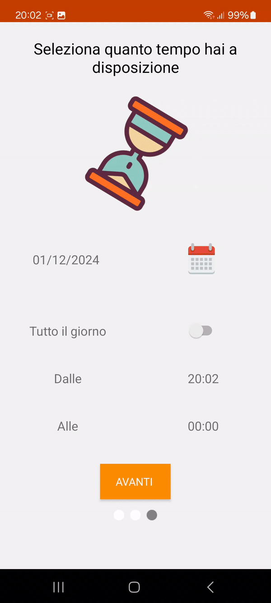

<h1>Progetto TOurist</h1>

L'Idea TOurist è un progetto Android nato con lo scopo di dare una mano ai turisti che vengono a visitare la città di Torino.

Volevamo dare ai nostri utenti un resoconto veloce dei posti di interesse, in modo rapido, senza registrazioni o pagamenti in app.

All'avvio, l'app richiede 3 informazioni all'utente:
 - Selezionare il numero di persone
 - Selezionare il budget in possesso
 - Selezionare il tempo a disposizione
 
Dopo che vengono inseriti i dati, verrà mostrata una mappa con i punti di interesse relativi e in alto, all'interno della toolbar, la temperatura esterna in quel momento. 

Ogni scelta dell'utente nelle prime 3 schermate modificheranno il risultato finale.

Nella prima schermata, relativa al numero di persone, l'utente può selezionare 3 scelte: "Singolo", "In coppia" o "In gruppo".

Nella seconda schermata, quella relativa al budget in possesso, l'utente può selezionare due scelte: "Gratuito" o inserire un range di quanto denaro vuole spendere tramite un "Range Picker".

Le prime due schermate sono strettamente collegate tra loro:

Ogni scelta condizionerà la schermata successiva, ad esempio se si seleziona "Singolo", allora la gestione della schermata relativa al budget verrà trattata in modo differente, inserire 100 euro come budget a disposizione per un "Singolo", darà un risultato diverso rispetto a selezionare 100 euro per un "Gruppo".

Nella terza schermata, quella relativa al tempo a disposizione, l'utente può selezionare il giorno tramite un bottone che funge da calendario, ed infine se ha tutto il giorno a disposizione o solo un range temporale, sempre tramite selezione.

Infine, si avvia la quarta ed ultima schermata, con toolbar, mappa e tre pulsanti nella parte inferiore. 

Qui verrà chiesto all'utente di attivare il gps, per la geolocalizzazione, e se l'utente si troverà al di fuori di Torino, verrà mostrato un popup di informazione, potendo comunque usare l'app anche se non nella sua funzione principale.

Nella toolbar viene visualizzato a sinistra il nome dell'app ed a destra la temperatura esterna in quel preciso momento.

Sulla mappa vengono mostrati i punti di interesse tramite dei marker in base alle scelte fatte fino ad ora. 

Al click sull'marker che ci interessa, verranno visualizzate le informazioni principali del posto selezionato tramite un custom layout, se alcuni dati non sono stati resi noti, verrà modificato il layout di conseguenza.

La mappa, come anche la toolbar, cambieranno in base all'ora. 

Se l'app viene aperta di notte, lo stile della mappa e della toolbar cambieranno, sono stati utilizzati due stili differenti per il giorno e la notte.

Nella parte inferiore, vengono visualizzati tre pulsanti: musei, cinema e ristoranti, utilizzati per filtrare il tipo di posto visualizzato nella mappa.

<h2>Tecnologie principali</h2>

Maps SDK - per la gestione della mappa

Places SDK - per accedere al database di Google di informazioni sui posti attorno all'utente

OpenWeather - per la gestione dei dati meteorologici

<h2>Screenshots</h2>

